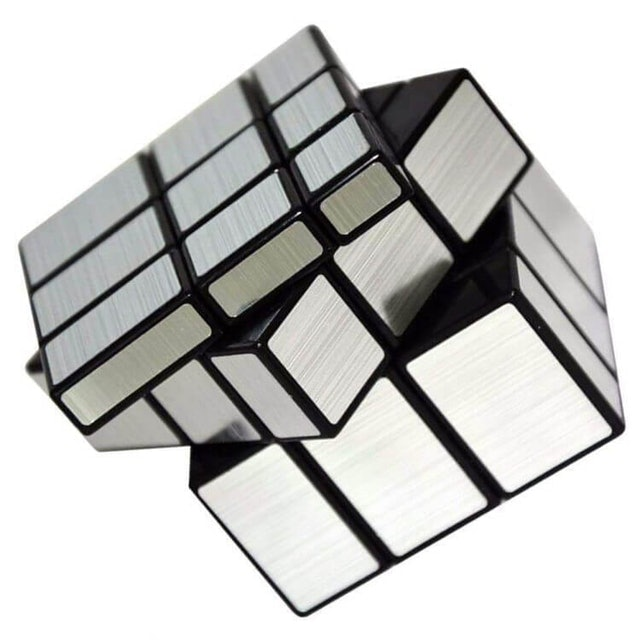
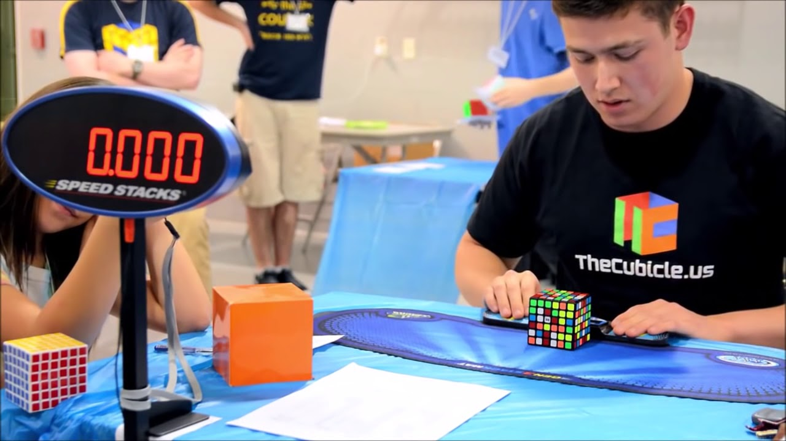

## The history of the World Rubik's Cube and the organizers
<html lang="en">
<head>
    <meta charset="UTF-8">
    <title>Introduction to World Rubik's Cube</title>

<body>

<h1>The World Rubik's Cube Championship is the highest-level Rubik's Cube racing championship in the world certified by the World Rubik's Cube Association. Since 2003, the event has been held every two years. Each event has established official events recognized by the World Rubik's Cube Association at that time. The winner of each event will be given the title of "World Champion", and the top three will be awarded a commemorative event. Medals or trophies and corresponding prizes or bonuses</h1>

Race history
    On June 5, 1982, the first World Rubik's Cube Championship was held in Budapest, Hungary. At that time, only a third-order Rubik's Cube was set up. 19 contestants from 19 different countries participated in the competition. Although the organizers decided to continue to hold competitions in the future, but in the following years, the upsurge of Rubik's Cube in the world gradually faded. In 2003, Rubik's Cube fans held the second World Championships in Toronto. This can be called the "first modern Rubik's Cube competition" and achieved great success[2], but there are also many problems, very big Partly because of the lack of organizational supervision. The following year, WCA was formally established. WCA recognized the nature and results of the previous two competitions as World Championships, and formally established a system of holding the World Championships every two years.

The World Rubik's Cube Competition is organized by the World Rubik's Cube Association. The World Rubik's Cube Association (WCA) is an organization that manages the affairs of Rubik's Cube events worldwide. WCA was originally founded by Ron van Bruchem from the Netherlands and Mao Taisheng from the United States. [1] The mission of the World Rubik's Cube Association is "Hold more competitions in more countries, so that more friends can have fun in a fair and just atmosphere." [2] On November 20, 2007, they decided to WCA is registered as a non-profit organization. In 2017, California officially accepted the registration of the World Rubik's Cube Association.

    The World Rubik's Cube Association is managed by its board of directors, and has different teams, committees, and WCA representatives who are qualified to organize official competitions. Only when a WCA representative is present at the certification competition will it be recognized by the WCA. As of July 2019, more than 127,000 Rubik's Cube enthusiasts from all over the world have participated in the WCA event and have become WCA members whose results have been recorded and recognized

World Cube Contest World Record，
    In 2009, he participated in the first official competition (New Zealand Championship) and won the championship with an average of 13.74 seconds for the third-order cube. Since 2010, a total of 121 world records have been set. On May 5, 2018, Felix set the world record for the third-order Rubik's Cube with a time of 4.22 seconds (has been broken by Du Yusheng 3.47), and recently set his own record in Auckland summer 2020 to reach a single 4.16 seconds.

<iframe width="900" height="600" src="https://www.youtube.com/embed/DG-Fp_ZvyGk" title="YouTube video player" frameborder="0" allow="accelerometer; autoplay; clipboard-write; encrypted-media; gyroscope; picture-in-picture" allowfullscreen></iframe>
</body>

